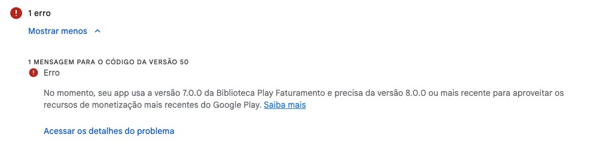
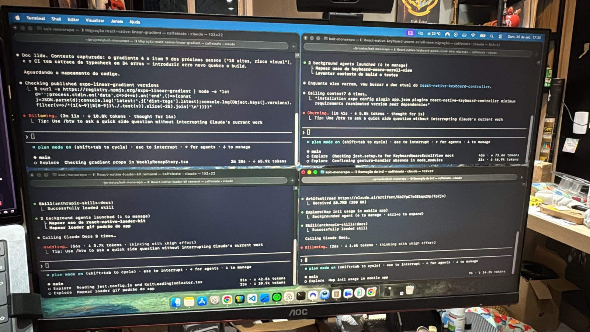
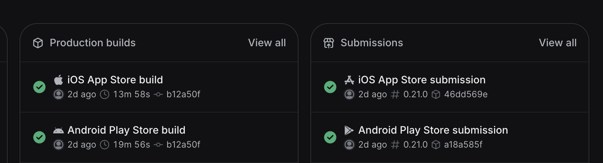

Fala galera, Caio aqui! Hoje eu quero contar por que eu fiz uma migração de um app React Native 0.79 JSC + legacy architecture para Expo 57 + RN 0.86 + Hermes + New Architecture e como isso levou apenas 18h humanas ao longo de 5 dias.

> Um breve contexto: o motor executa o JavaScript do app. O JSC (JavaScriptCore) é o motor do Safari: no iOS vem do sistema, mas no Android precisa ir empacotado dentro do app. O Hermes foi criado pela Meta para o React Native e, nas builds de release, recebe o código já compilado, o que faz o app abrir mais rápido.
>
> Já a arquitetura decide como esse JavaScript conversa com o nativo: a antiga ("legacy architecture") passa tudo por uma ponte, uma fila de mensagens assíncronas, enquanto a New Architecture deixa o JavaScript chamar o nativo diretamente.

## Os débitos do app

O aplicativo foi feito no modo freela por mim há cerca de 2,5 anos. De lá pra cá, o app mudou muito: saiu de uma Material UI para design system próprio, features novas e features removidas, e pouquíssimas atualizações de bibliotecas e SDKs. Essa negligência nas atualizações foi o nosso grande erro e fez com que a gente chegasse a esse patamar:

- Devido ao JSC + legacy architecture, o ambiente de desenvolvimento acumulou um crash sempre que precisávamos dar reload no app, o que forçava uma nova build a cada mudança no código e obviamente atrasava muito o desenvolvimento.
- O nível da API do Android estava abaixo do necessário (API 36). Porém, tinha conseguido postergar essa data em 2 meses, o que nos deu um fôlego.
- No dia em que fui buildar a nova release, meu Xcode atualizou e quebrou a versão iOS. Felizmente, uma DEV do time tinha a versão correta e conseguiu fazer a build de lá.
- Mas foi na hora de enviar para a Play Store que fomos bloqueados: o nível do SDK do Play Faturamento (Android) também precisava ser atualizado para a versão 8. Sem chance de adiar a data de corte, aqui não deu pra fugir, precisávamos de fato atualizar.

Diante desses desafios e com os benefícios de utilizar o Expo em mente, como a build em nuvem, as atualizações de SDK facilitadas e a possibilidade de utilizar OTA releases no futuro, decidi fazer essa migração.

## Dia 01: Planejamento e validações necessárias

Eu já tinha tudo em mente, pois fui pensando ao longo dos dias. Iniciei criando um artefato com o Claude para descrever nossos débitos e validações necessárias, as fases da migração e onde queríamos chegar. Dediquei cerca de duas horas a esse processo. Também utilizei esse mesmo documento de forma contínua durante o processo para ir registrando novos débitos encontrados (ou gerados por conta da migração). A ideia era sempre manter o foco do agente no que ele estava fazendo: caso encontrasse coisas novas, ele registrava no documento e seguia.

> Um fato engraçado aqui é que o Claude Code "previu" que seriam necessárias semanas para fazer a migração completa. Tadinho, mal sabia ele que seria possível e que ele mesmo faria tudo sozinho. Ignorei ele e confiei no meu planejamento.

Com o planejamento estruturado, parti para a fase 0, que era fazer uma validação do crash do Hermes, que era o grande vilão do projeto há meses. Quatro horas seguidas rodando um teste de fumaça, onde o objetivo era criar um app novo do zero, já com a nova arquitetura e o Hermes ativado, instalar as libs do sistema e verificar se o crash persistiria no projeto. E, para a alegria de todos, no final desse processo consegui constatar que com as atualizações eu conseguiria de vez sanar essa dor.

Já com essa confirmação, parti para a migração direta do app para Expo. Esse processo durou cerca de 2 horas de trabalho meu, mescladas entre decisões que precisei tomar no planejamento específico dessa fase e a validação do app. No final do primeiro dia, já tínhamos o crash de meses solucionado e o app rodando em Expo e uma tonelada de dependências para atualizar e erros de tipagem para resolver, todos eles devidamente registrados no artefato da migração.

## Dia 02: Migração intensa de dependências obsoletas

Esse pra mim foi o dia mais legal! Durante a migração para o Expo, eu gerei uma lista grande de dependências que precisavam ser tratadas, removidas ou atualizadas. Olhei cuidadosamente para o artefato da migração e fui selecionando uma a uma as pendências, e fiz de forma paralelizada, escolhendo libs e funções que tivessem o mínimo de interdependência possível, evitando conflitos na hora de juntar todas as worktrees.

Para paralelizar esse trabalho, eu coloquei o máximo de 4 sessões de Claude Code. Então fui fazendo uma a uma, cada uma com sua worktree, passando o Claude primeiro no modo planejamento e depois execução do trabalho. Basicamente, em alguns momentos eu estava validando uma mudança de deps e em outros decidindo qual caminho seguir. Eram 4 sessões, então praticamente não teve momento em que eu fiquei ocioso. Sempre que terminava em uma sessão, já tinha outra para eu avaliar ou decidir. No total, foram 7h nessa parte da migração, com um intervalo de 2h em que eu parei pra assistir ao Fantástico (mas o Claude continuou rs), e 15 sessões.

## Dia 03: Caça aos bugs frenética e a primeira build

Uma outra pendência que foi gerada logo após a migração para o Expo foram os erros de tipagem. Inicialmente pareciam inofensivos, mas, durante um dos testes que precisei fazer durante a atualização das dependências, me deparei com um crash, justamente onde um dos erros de tipagem morava. Então é isso, seguimos forte na missão: foram cerca de 23 erros corrigidos ao longo de 3h de trabalho e muitos tokens queimados.

Durante essas horas, também paralelizei um outro objetivo que tinha para esse dia: lançar uma build nas lojas para teste interno. Optei por fazer essa primeira versão 100% na minha máquina, sem depender de EAS ou nuvem. Era assim que funcionava antes, então foi assim que eu fiz aqui também e, no final do dia, tínhamos uma build na loja e o time recebeu o repositório novo para trabalhar. Todos felizes, o stakeholder adorou o playground novo, mais rápido, mais documentado e simples de trabalhar.

## Dias 04 e 05: Testes reais na build e envio para as lojas

O clima já era de vitória, mas ainda faltava fazer a release oficial para as lojas. Portanto, dedicamos o 4º dia a um teste geral da release, onde não só eu usei o app, mas também os outros integrantes do time. Além disso, os devs do time já entraram no circuito e adicionaram novas features já no app novo: o ciclo de desenvolvimento não parou em nenhum momento.

E então chegou o grande dia. Foram mais quatro horas de trabalho, onde fiz um refinamento de alguns detalhes, correções de bugs bem pontuais e toda a configuração do EAS. Finalmente estávamos livres das builds locais e da necessidade de um MacBook para fazer isso. Para finalizar, um resquício de ação humana: precisei mover manualmente as versões para produção nos painéis das lojas Android e iOS.

## Números que chamaram minha atenção

Foram 5.197 chamadas ao modelo de LLM (via Claude Code). Ao todo, 1,2 bilhão de tokens gastos para essa mudança, o que daria em torno de 813 dólares caso fosse feito via API (usei o plano do Claude Code, então não paguei nem perto disso). 23 sessões no total e 213 prompts enviados para a IA (23 sessões, mas várias interações em cada uma delas).

O Claude também contou ~33 horas de sessão ativa (contando sessões que rodaram em paralelo) e em torno de 22 horas com pelo menos uma sessão ativa.

## Pós-publicação nas lojas

Nem tudo são flores. Cerca de uma semana após o envio, recebemos um reporte de erro. No iOS, o módulo nativo dos termos que portamos para o Expo esperava números inteiros, mas o Expo entrega todo número do JavaScript como Double. O download nem começava, e nenhum teste cobria o lado Swift. Hoje cobre, num job de CI em macOS. Coisa simples, mas que teve um custo, pois afetava o fluxo de onboarding (aquisição) do app. Fica aí o alerta.

Fora isso, também segui com outras fases da migração que eu não comentei aqui antes. Mas, além dessa migração parruda, saímos de 3 repositórios isolados para um monorepo. Todo configurado com mise, pnpm e OpenSpec, que trouxe um fluxo de trabalho totalmente novo e eficaz para o time.

## Conclusão

Esse aplicativo em questão atravessou a era pré e pós-IA. Há dois anos, foi feito na mão, com no máximo alguns autocompletes das IAs que já existiam no mercado. Hoje, com um fluxo de desenvolvimento orientado a Spec, quase que 100% orientado a IA, com humanos no centro das decisões, e não mais digitando o código em si.

Espero que tenham gostado, galera. Resolvi trazer, pois acredito que esse processo de migração para techs mais novas vai ficar cada vez mais fácil. Já não sou o primeiro postando cases como esse e tenho certeza de que também não serei o último. Aproveitem seus tokens o máximo possível!
